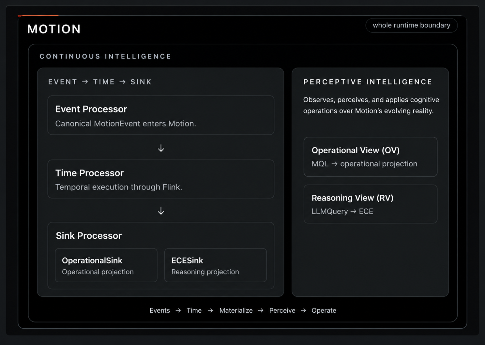

# Perceptive Intelligence



Motion is Continuous Intelligence.

Its runtime continuously evolves two complementary memories of reality:

- **Operational View** — operational reality: what is happening.
- **Reasoning View** — reasoning reality: the facts and relationships available for reasoning.

Perceptive Intelligence operates over those memories.

Its core flow is:

```text
Operational View + Reasoning View
                ↓
           Observation
                ↓
           Perception
                ↓
 Cognitive Operation Pipelines
                ↓
 Governance / Authority
                ↓
              Reality
```

The boundaries between these stages are intentional.

---

## 1. Memory of Reality

Motion already maintains the substrate on which Perceptive Intelligence operates.

```text
Operational View          Reasoning View
      │                         │
      └──────────┬──────────────┘
                 ↓
          Memory of Reality
```

The two views serve different purposes.

The **Operational View** represents operational state.

The **Reasoning View** is physically represented today by CGO `GraphView`: facts and relationships accumulated for reasoning.

Perceptive Intelligence does not need to know how either view was created.

It operates on the memory that already exists.

---

## 2. Observation

Observation answers one question:

> **What did I see?**

An Observation is the composite representation of what was seen across Motion's operational and reasoning memory.

Today its physical components are:

```text
Observation
├── OperationalView
└── GraphView
```

Observation does not care:

- how either view was created;
- how reality was selected;
- how reality was filtered;
- what developer declaration caused it to be observed;
- what perspective will later interpret it;
- what anyone intends to do with it.

Those concerns belong elsewhere.

Observation is simply the state that was seen.

It continuously feeds the Perception pipeline.

### Current implementation

Observation is the first implemented Perceptive Intelligence component.

It is intentionally small.

The simplicity is structural: Observation is a driver primitive. Complexity belongs in the machinery that produces and consumes it, not inside the model itself.

---

## 3. Perception

Observation tells Motion what was seen.

Perception represents what was understood from what was seen.

```text
Observation
     ↓
Perception
```

Perception is formed through a perspective.

The same Observation may therefore produce different Perceptions.

```text
                  Observation
                       │
          ┌────────────┼────────────┐
          ▼            ▼            ▼
    Perspective A  Perspective B  Perspective C
          │            │            │
          ▼            ▼            ▼
    Perception A   Perception B   Perception C
```

The underlying Observation can be shared.

The resulting understanding does not have to be.

### Perception is transient shared state

Once produced for a perspective, a Perception becomes reusable state.

Multiple downstream consumers may operate on the same Perception independently.

```text
                    Perception
                        │
          ┌─────────────┼─────────────┐
          ▼             ▼             ▼
       Team A          Team B        Team C
          │             │             │
       Pipeline A    Pipeline B    Pipeline C
```

This gives us an important rule:

> **Perceive once. Operate many.**

Perception does not know why a consumer wants it.

It does not prescribe an action.

It does not own workflow execution.

It does not automatically become durable.

At the Perception boundary, its semantics are opaque to the runtime: it is shared state ready for downstream cognitive processing.

---

## 4. Cognitive Operation Pipelines

Perception completes before operational intent begins.

Downstream consumers attach their own **Cognitive Operation Pipelines** to Perception.

```text
Perception
     ↓
Cognitive Operation Pipeline
     ↓
developer-defined cognitive work
```

Different teams may attach completely different pipelines to the same Perception.

For example:

```text
Perception → Retain

Perception → Compare → Evaluate

Perception → Interpret → Retain

Perception → Compare → Interpret → Evaluate → Act

Perception → Ignore
```

These are examples.

There is no canonical sequence.

There is no fixed exhaustive ontology of cognitive operations.

The pipeline belongs to the developer or consuming application.

Perception remains unchanged and reusable.

---

## 5. Cognitive Capabilities

The following capabilities have been identified as useful starting points.

They are not a closed enum and they do not define the limits of cognition.

### Retain

**Retain preserves a chosen Perception for a downstream purpose.**

Perception is transient by default.

Retain is an explicit downstream decision to make perceptive state durable.

```text
Perception
     ↓
Retain
     ↓
durable downstream state
```

Retain does not:

- create the Perception;
- change its meaning;
- decide that it is important;
- own the Perception lifecycle;
- prevent other consumers from using the same Perception.

Multiple teams may independently retain the same Perception for different purposes.

No dedicated Perception store is assumed.

If operation execution history provides the durability and history required by the system, another persistence layer is unnecessary.

A distinct Perception store should exist only if a future domain requirement earns one.

### Compare

**Compare determines what changed.**

It consumes Perception state and identifies differences relative to a relevant reference state.

```text
Perception(s)
     ↓
Compare
     ↓
Comparison State
"What changed?"
```

Compare may operate continuously over an evolving Perception stream.

For example:

```text
T1 → baseline
T2 → no meaningful difference
T3 → state changed
T4 → change continued
```

The reference may eventually be previous state, another Perception, another stream, or a developer-defined baseline.

That belongs to Compare's declaration and execution machinery.

Compare itself does not decide whether a difference is good, bad, important, or actionable.

It establishes the difference.

State required for comparison belongs to the Compare operation, not to Perception.

### Interpret

**Interpret derives meaning from Perception.**

```text
Perception
     ↓
Interpret
     ↓
Interpretation State
"What does this mean now?"
```

Interpret is naturally reasoning-heavy.

The Reasoning View, CGO, Arc, an LLM, or another intelligence substrate may participate in its execution.

Those are implementation mechanisms, not the semantic definition of Interpret.

Interpret is broader than summarization.

As Perception evolves, interpretation may evolve continuously:

```text
P1 → appears to mean X
P2 → X is spreading
P3 → X now appears related to Y
```

Interpret does not decide whether the resulting meaning matters operationally.

It produces meaning.

### Evaluate

**Evaluate determines whether developer-declared operational conditions are satisfied.**

```text
Perception / Cognitive State
            +
Developer Criteria
            ↓
         Evaluate
            ↓
     Evaluation State
```

Evaluate is the bridge between understanding the system and potentially changing it.

```text
Evaluate
   │
   ├── condition not satisfied
   │       → no mutation path
   │
   └── condition satisfied
           ↓
     system-mutation territory
```

Evaluate itself does not mutate reality.

It establishes whether the developer's declared condition has been met.

The mutation boundary begins after Evaluate.

### Learn

**Learn allows cognitive state to change what the system can understand in the future.**

```text
Cognitive State
      ↓
    Learn
      ↓
Evolved Understanding
```

The distinction from Retain is important:

```text
Retain
→ preserve what was perceived

Learn
→ evolve what can be understood
```

Exactly how Learn changes reasoning memory, what governance it requires, and what operational value it provides will be earned through implementation.

The semantic boundary is intentionally small.

### Act

**Act enters operational mutation territory.**

```text
Evaluation / Cognitive State
            ↓
           Act
            ↓
    Proposed Mutation
            ↓
Deterministic / Governance Gate
            ↓
          Reality
```

Act does not give intelligence sovereign authority over operational reality.

It may produce a proposed mutation.

Deterministic and governance machinery decides whether that proposal becomes real.

The authority rule remains:

> **Intelligence may propose. The runtime decides what becomes reality.**

### Ignore

**Ignore means no further processing is requested for this Perception.**

```text
Perception
     ↓
Ignore
     ↓
     ∅
```

A valid Perception does not imply that something must happen.

Doing nothing is a valid outcome.

---

## 6. Data, State, Execution, Authority

The architecture separates four concerns.

### Reality and memory

```text
Operational View
Reasoning View
```

These hold Motion's evolving reality.

### Perceptive state

```text
Observation
Perception
```

Observation represents what was seen.

Perception represents what was understood.

### Operational execution

```text
Cognitive Operation Pipelines
```

These operationalize Perception according to developer intent.

### Authority

```text
Governance
Deterministic Gates
```

These control what is allowed to change reality.

The resulting separation is:

> **OV/RV hold reality.**

> **Observation holds what was seen.**

> **Perception holds what was understood.**

> **Operation Pipelines operationalize that understanding.**

> **Governance controls what gets authority to change reality.**

---

## 7. Operation Pipeline Execution

Perception is intentionally independent of workflow execution.

A Perception may feed multiple independently owned operation pipelines.

```text
                    Perception
                        │
       ┌────────────────┼────────────────┐
       ▼                ▼                ▼
   Pipeline A        Pipeline B       Pipeline C
       │                │                │
 cognitive work     cognitive work    cognitive work
```

`llm-orchestra` is a natural candidate for executing these pipelines.

Its existing product/runtime capabilities may also provide operational visibility through Conductor:

- which pipeline executed;
- which operation ran;
- execution state;
- failures;
- retries;
- timing;
- downstream effects.

This fit must be verified against the existing `llm-orchestra` source when implementation reaches this boundary.

It is not a dependency of Perception itself.

---

## 8. Persistence

Motion does not automatically persist every Perception.

Perception is transient shared state.

Durability is explicit downstream behavior.

```text
Perception
     ↓
Retain / Operation Pipeline
     ↓
durable execution or domain state
```

If workflow execution history is sufficient to answer questions such as:

- which Perception triggered a pipeline;
- which operations ran;
- what succeeded or failed;
- what mutation was proposed;
- what ultimately changed;

then that history can provide operational visibility without introducing another store.

A dedicated Perception history store should not be created preemptively.

If a future requirement needs independently queryable historical Perceptions outside operation execution, that requirement can earn its own persistence boundary.

---

## 9. The Perceptive Intelligence Spine

The current locked mental model is:

```text
                 MOTION
          Continuous Intelligence

          MEMORY OF REALITY
       ┌────────────────────┐
       │ Operational View   │
       │ Reasoning View     │
       └─────────┬──────────┘
                 │
                 ▼
           OBSERVATION
          "What did I see?"
                 │
                 ▼
            PERCEPTION
       "What did I understand?"
       transient shared state
                 │
                 ▼
      COGNITIVE OPERATION
            PIPELINES
      developer / team defined
                 │
                 ▼
       operational execution
                 │
                 ▼
      GOVERNANCE / AUTHORITY
                 │
                 ▼
              REALITY
```

The heart of the model is simple:

> **Perceive once. Operate many.**

Observation and Perception describe state.

Cognitive Operation Pipelines describe intent.

Governance describes authority.

Keeping those concerns separate allows Motion to continuously understand evolving operational reality without coupling that understanding to one team's workflow, one action, one intelligence substrate, or one persistence mechanism.
